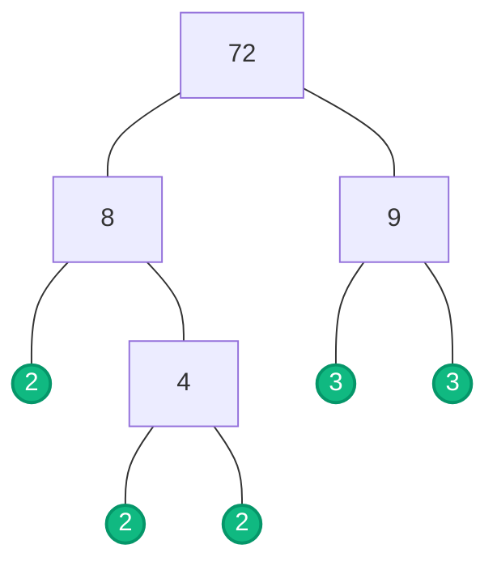

Before diving into complex algebra or geometry, you must speak the language of mathematics. This means knowing exactly what a question means when it asks for an "integer" or a "prime number."

---

## 1. The Number Zoo

Make sure you can identify these key types of numbers:

* **Natural numbers:** Whole numbers from 0 upwards (0, 1, 2, 3...).
* **Integers:** Positive and negative whole numbers, including zero (... -2, -1, 0, 1, 2 ...).
* **Rational numbers:** Any number that can be written as a simple fraction (like $\frac{1}{2}$, 0.75, or 5).
* **Irrational numbers:** Numbers that cannot be written as a simple fraction. Their decimals go on forever without repeating (like $\pi$ or $\sqrt{2}$).

<SteveTip title="The Integer Trap">
  In the exam, remember that **zero** is an integer, but it is **neither** positive nor negative! If a question asks for "positive integers," do not include 0.
</SteveTip>

### Special Numbers

Visualising these numbers makes them much easier to remember:

* **Prime numbers:** Numbers greater than 1 with exactly two factors: 1 and themselves (2, 3, 5, 7, 11...).
* **Square numbers:** The result of multiplying an integer by itself (1, 4, 9, 16, 25...). They can be arranged in a perfect square grid.
  
  $$ 
  \begin{array}{ccc} 
    \bullet & 
    \begin{matrix} \bullet & \bullet \\ \bullet & \bullet \end{matrix} & 
    \begin{matrix} \bullet & \bullet & \bullet \\ \bullet & \bullet & \bullet \\ \bullet & \bullet & \bullet \end{matrix} \\ 
    1 & 4 & 9 
  \end{array} 
  $$

* **Cube numbers:** The result of multiplying an integer by itself twice (1, 8, 27, 64...). These form 3D cubes.
* **Triangle numbers:** Numbers that can form a triangle pattern (1, 3, 6, 10, 15...).
  
  $$ 
  \begin{array}{ccc} 
    \begin{matrix} \\ \bullet \end{matrix} & 
    \begin{matrix} \\ \bullet \\ \bullet \quad \bullet \end{matrix} & 
    \begin{matrix} \bullet \\ \bullet \quad \bullet \\ \bullet \quad \bullet \quad \bullet \end{matrix} \\ 
    1 & 3 & 6 
  \end{array} 
  $$

* **Reciprocals:** What you multiply a number by to get 1. For example, the reciprocal of 5 is $\frac{1}{5}$.

<SteveTip title="The Prime Number Trap">
A very common misconception is thinking that 1 is a prime number. **1 is NOT prime!** The number 2 is the smallest prime number, and it is also the only even prime number.
</SteveTip>

---

## 2. Words and Digits

You must be able to translate fluently between large numbers in digits and words. Remember your place values!

* **6 000 000 000** is written as **six billion**.
* **10 007** is written as **ten thousand and seven**.

---

## 3. Factors, Multiples, and Primes

* **Factors:** Numbers that divide exactly into another number. (The factors of 10 are 1, 2, 5, and 10).
* **Multiples:** The "times tables" of a number. (The multiples of 10 are 10, 20, 30, 40...).

### Prime Factorisation

To express a number as a product of its prime factors, you break it down until only prime numbers remain. There are two popular ways to do this. Let's use **72** as our example.

#### Method A: The Factor Tree

Split the number into any two factors. Keep splitting the branches until you hit a prime number.

#### Method B: The Ladder Method (Repeated Division)
Divide the number by the smallest possible prime number. Write the answer underneath, and repeat until you reach 1.

$$
\begin{array}{r|l}
\mathbf{2} & 72 \\
\hline
\mathbf{2} & 36 \\
\hline
\mathbf{2} & 18 \\
\hline
\mathbf{3} & 9 \\
\hline
\mathbf{3} & 3 \\
\hline
  & 1
\end{array}
$$

<Steps>

1.  Divide 72 by the smallest prime (2): 72 ÷ 2 = 36
2.  Divide 36 by 2: 36 ÷ 2 = 18
3.  Divide 18 by 2: 18 ÷ 2 = 9
4.  9 doesn't divide by 2, so try the next prime (3): 9 ÷ 3 = 3
5.  Divide 3 by 3 to get 1.

</Steps>

Using either method, you gather all the circled primes or the bolded numbers on the outside of your ladder. Write it out in index form (using powers):

$$72 = 2 \times 2 \times 2 \times 3 \times 3 = 2^3 \times 3^2$$

<SteveTip title="The Power of Index Form">
Always check the question! Most exam questions require the final answer in index form (using powers).
</SteveTip>

### HCF and LCM from Standard Numbers

Let's find the **Highest Common Factor (HCF)** and **Lowest Common Multiple (LCM)** of two numbers: 24 and 60.

First, write out their prime factors:
* 24 = 2 × 2 × 2 × 3
* 60 = 2 × 2 × 3 × 5

<Aside type="tip" title="HCF and LCM Rules">
* **HCF:** Multiply the prime factors they have in **common**.
* **LCM:** Multiply the HCF by all the **leftover** factors.
</Aside>

**Finding the HCF:**
They share two 2s and one 3.
$$\text{HCF} = 2 \times 2 \times 3 = 12$$

**Finding the LCM:**
Take the HCF (12) and multiply by the unused leftover factors (a 2 from the 24, and a 5 from the 60).
$$\text{LCM} = 12 \times 2 \times 5 = 120$$

### HCF and LCM from Index Form (Extended)

In IGCSE Extended, you are often given numbers already in index form. You do **not** need to expand them into massive numbers! Just compare their powers:

* **HCF:** Take the **lowest** power of each common prime factor.
* **LCM:** Take the **highest** power of *every* prime factor present.

---

## 4. Practice Problems

<Tabs>
  <TabItem label="📝 Question 1: Number Types">
    From the following list of numbers:  
    **-7,  0,  $\frac{3}{4}$,  $\sqrt{5}$,  11,  36**

    Identify:
    1. A prime number
    2. An irrational number
    3. A square number
    4. Two integers
  </TabItem>
  <TabItem label="✅ Solution 1">
    1. **Prime number:** 11
    2. **Irrational number:** $\sqrt{5}$
    3. **Square number:** 36 (since 6 × 6 = 36)
    4. **Two integers:** Choose any two from -7, 0, 11, or 36. ($\frac{3}{4}$ is rational, $\sqrt{5}$ is irrational).
  </TabItem>
</Tabs>
<AIGenerator topic="Identifying number types: natural, integer, rational, irrational, prime, square" difficulty="IGCSE Core" client:load />

<Tabs>
  <TabItem label="📝 Question 2: Words to Digits">
    Write the following number in digits:  
    **"Three million, four hundred and twenty thousand, and twelve."**
  </TabItem>
  <TabItem label="✅ Solution 2">
    Break it down by place value:
    * Three million: 3 000 000
    * Four hundred and twenty thousand: 420 000
    * Twelve: 12
    
    **Answer:** 3 420 012
  </TabItem>
</Tabs>
<AIGenerator topic="Converting large numbers from words to digits and place value" difficulty="IGCSE Core" client:load />

<Tabs>
  <TabItem label="📝 Question 3: Prime Factors">
    Express 300 as a product of its prime factors. Give your answer in index form.
  </TabItem>
  <TabItem label="✅ Solution 3">
    Divide by primes: 300 → 150 → 75 → 25 → 5 → 1
    
    $$300 = 2 \times 2 \times 3 \times 5 \times 5$$
    
    **Answer:** $$300 = 2^2 \times 3 \times 5^2$$
  </TabItem>
</Tabs>
<AIGenerator topic="Expressing a number as a product of its prime factors in index form" difficulty="IGCSE Core" client:load />

<Tabs>
  <TabItem label="📝 Question 4: HCF & LCM (Basic)">
    Find the Highest Common Factor (HCF) and Lowest Common Multiple (LCM) of 18 and 30.
  </TabItem>
  <TabItem label="✅ Solution 4">
    Prime factors:
    * 18 = 2 × 3 × 3
    * 30 = 2 × 3 × 5

    **HCF:** They share a 2 and a 3.
    $$\text{HCF} = 2 \times 3 = 6$$

    **LCM:** Take the HCF (6) and multiply by the leftover factors (a 3 from the 18, and a 5 from the 30).
    $$\text{LCM} = 6 \times 3 \times 5 = 90$$
  </TabItem>
</Tabs>
<AIGenerator topic="Finding the HCF and LCM of two basic 2-digit numbers" difficulty="IGCSE Core" client:load />

<Tabs>
  <TabItem label="📝 Question 5: HCF & LCM (Challenge)">
    Find the HCF and LCM of 36 and 84.
  </TabItem>
  <TabItem label="✅ Solution 5">
    Prime factors:
    * 36 = 2 × 2 × 3 × 3
    * 84 = 2 × 2 × 3 × 7

    **HCF:** They share two 2s and one 3.
    $$\text{HCF} = 2 \times 2 \times 3 = 12$$

    **LCM:** Take the HCF (12) and multiply by the leftover factors (a 3 from the 36, and a 7 from the 84).
    $$\text{LCM} = 12 \times 3 \times 7 = 252$$
  </TabItem>
</Tabs>
<AIGenerator topic="Finding the HCF and LCM of larger 2-digit numbers using prime factorisation" difficulty="IGCSE Core" client:load />

<Tabs>
  <TabItem label="📝 Question 6: HCF & LCM in Index Form (Extended)">
    Given $A = 2^3 \times 5^2 \times 7$ and $B = 2 \times 7^3$, find the HCF and LCM of $A$ and $B$. Leave your answers in index form.
  </TabItem>
  <TabItem label="✅ Solution 6">
    Use the power rules for index form:
    
    **For the HCF:** Take the **lowest** power of the primes they have in common (which are 2 and 7. Note that 5 is not in both).
    * Lowest power of 2 is $2^1$
    * Lowest power of 7 is $7^1$
    
    **HCF:** $2 \times 7$
    
    **For the LCM:** Take the **highest** power of *every* prime factor present across both numbers.
    * Highest power of 2 is $2^3$
    * Highest power of 5 is $5^2$
    * Highest power of 7 is $7^3$
    
    **LCM:** $2^3 \times 5^2 \times 7^3$
  </TabItem>
</Tabs>
<AIGenerator topic="Finding HCF and LCM when numbers are already given in index form (comparing highest/lowest powers)" difficulty="IGCSE Extended" client:load />