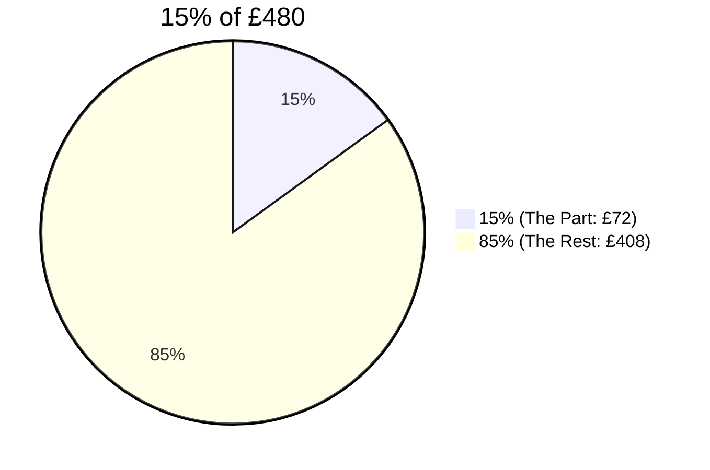
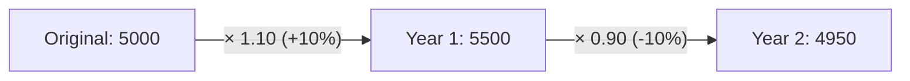
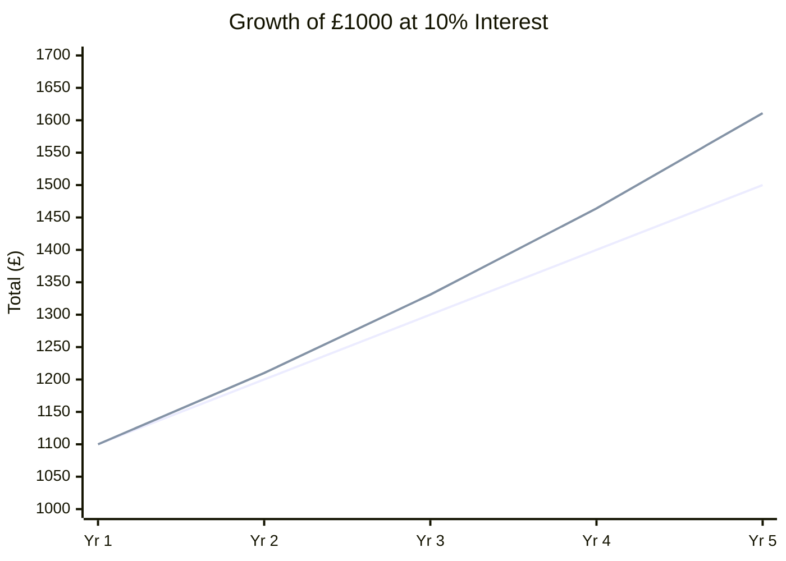
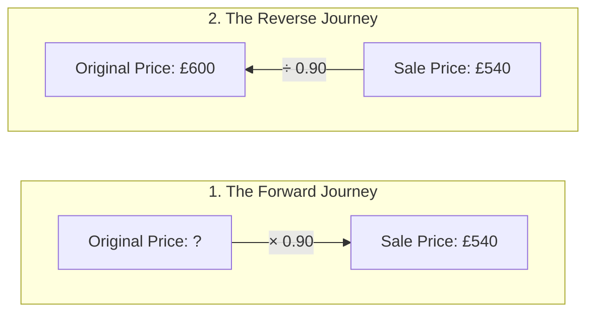

Percentages are parts of 100. Whether you are calculating a store discount, a bank's interest rate, or a business profit, the goal is to understand how a portion relates to the whole.

---

## 1. Finding a Percentage of a Quantity

To find a percentage of an amount, convert the percentage to a decimal (the **multiplier**) and multiply.

* **Method:** Divide the percentage by 100, then multiply by the quantity.
* **Example:** Find 15% of £480.
    1. $15 \div 100 = 0.15$
    2. $0.15 \times 480 = 72$
    **Answer:** £72

---

## 2. Expressing One Quantity as a Percentage of Another

This is essentially "writing a test score." You create a fraction representing the part over the whole, and then turn it into a percentage.

* **Formula:** $\frac{\text{Part}}{\text{Whole}} \times 100$
* **Example:** A student scores 34 out of 40 on a mental maths test. What is their percentage?
    1. $\frac{34}{40} = 0.85$
    2. $0.85 \times 100 = 85$
    **Answer:** 85%

---

## 3. Percentage Increase and Decrease

You can do this in two steps (find the percentage, then add/subtract), but using a **multiplier** is much faster and absolutely essential for harder "repeated change" questions.

### The Multiplier Method
* **Increase by 20%:** The original is 100%. $100\% + 20\% = 120\%$. As a decimal: **1.20**
* **Decrease by 15%:** The original is 100%. $100\% - 15\% = 85\%$. As a decimal: **0.85**

**Example:** A coat costs £120. It is reduced by 35% in a sale. Find the new price.
1. Multiplier: $100\% - 35\% = 65\% \rightarrow 0.65$.
2. Calculation: $120 \times 0.65 = 78$.
**Answer:** £78

### Chained (Repeated) Percentage Changes
When an amount undergoes multiple percentage changes over time, you **multiply the multipliers**. You never just add or subtract the percentages themselves.

**The Timeline of a Chained Change:**
Let's say a population of 5000 increases by 10% in Year 1, and then decreases by 10% in Year 2.

* **Fast Calculation:** $5000 \times 1.10 \times 0.90 = 4950$.

<Aside type="caution" title="Pitfall: The '+10% then -10%' Trap">
A massive misconception is thinking that increasing by 10% and then decreasing by 10% brings you back to the original starting number. It does NOT! 
The second percentage change (the decrease) is calculated on the **new, larger amount**, so it takes a bigger bite out of the total.
</Aside>

<SteveTip title="Profit and Loss">
"Profit" is just a fancy word for **percentage increase**. "Loss" is a **percentage decrease**. 
If a shopkeeper buys a phone for £200 and sells it for £250:
1. Profit = £50.
2. Percentage Profit = $\frac{50}{200} \times 100 = 25\%$.
</SteveTip>

---

## 4. Simple and Compound Interest

This is a favorite Paper 4 topic. Note that **formulas are not provided** in the exam.

### Simple Interest
Interest is only calculated on the **original** amount. It stays exactly the same every single year. It is a linear sequence.
* **Formula:** $I = \frac{P \times R \times T}{100}$ (where $P$ = Principal/Original Amount, $R$ = Rate, $T$ = Time).

### Compound Interest
Interest is calculated on the **new total** each year (you earn interest on your interest). This creates exponential growth.
* **Formula:** $\text{Total Amount} = P \times (\text{Multiplier})^T$

*(The lower straight line represents Simple Interest; the upper curved line represents Compound Interest)*

**Example: £2000 is invested at 4% per year compound interest for 3 years.**
1. Multiplier for 4% increase: $1.04$
2. Calculation: $2000 \times (1.04)^3 = 2249.73$
**Answer:** £2249.73

<Aside type="caution" title="Pitfall: Interest vs. Total Balance">
Read the question carefully! Does it ask for the **total amount** in the bank or just the **interest earned**? 
If it asks for interest only: **[Total Balance] - [Original Investment] = [Interest Earned]**.
</Aside>

---

## 5. Depreciation and Inflation

These use exactly the same mathematical structure as compound interest, but they represent real-world values changing over time.

* **Depreciation (Value Goes Down):** Used for cars, machinery, or technology. The multiplier is less than 1.
    * *Example:* A car worth £15,000 depreciates by 12% each year. Value after 5 years: $15,000 \times (0.88)^5$.
* **Inflation (Value Goes Up):** Used for the cost of living, groceries, or house prices. The multiplier is greater than 1.
    * *Example:* Bread costs £1.20. If annual inflation is 3%, what is the cost after 2 years? $1.20 \times (1.03)^2$.

---

## 6. Solving for Unknowns (Advanced Extended)

Sometimes the exam flips the compound interest question and asks you to find the **Rate ($R$)** or the **Time ($n$)**.

### Finding an Unknown Rate (The nth Root)
If an investment of £500 grows to £600 in 4 years, what is the annual compound interest rate?
1. Set up the equation: $500 \times x^4 = 600$
2. Isolate the multiplier ($x$): $x^4 = \frac{600}{500} = 1.2$
3. Use the nth root on your calculator: $x = \sqrt[4]{1.2} \approx 1.0466$
4. Convert multiplier back to a percentage: A multiplier of $1.0466$ means a $4.66\%$ increase.
**Answer:** 4.66%

### Finding Unknown Time (Logarithms or Graphs)
If an investment of £1000 at 5% needs to reach £1500, how many years does it take?
1. Set up the equation: $1000 \times (1.05)^n = 1500$
2. Isolate the power: $1.05^n = 1.5$

<Aside type="note" title="Sneak Peek: Logs and Graphs">
To solve for an exponent like $n$, we will eventually use **Logarithms** (Chapter 3). For now, you can solve this by using the **Table** function on your calculator (inputting $y = 1.05^x$) or by sketching the graph and finding where it crosses the line $y = 1.5$.
</Aside>

---

## 7. Reverse Percentages (The "Original Value" Trap)

This is heavily tested in Paper 4. You are given the **final** value after a change has happened, and you are asked to find the **original** starting value.

**Example: A laptop is sold for £540 after a 10% discount. Find the original price.**

<Aside type="caution" title="Pitfall: The 10% Illusion">
Do not calculate 10% of £540 and add it on! The 10% discount was calculated based on the *original* (larger) price, not the sale price.
</Aside>

### The Reverse Timeline Method
Think about how the price moved forward in time, and then reverse the mathematics to go backward in time.

* **Calculation:** $540 \div 0.90 = 600$.
**Answer:** £600

<SteveTip title="Spotting the Reverse Question">
Whenever you see phrases like "Original price," "Before the increase," "Cost price," or "Prior to the sale," you are dealing with a **Reverse Percentage**. Your first step should always be to set up a division:
**[Final Amount] ÷ [Multiplier] = [Original Amount]**
</SteveTip>

---

## 8. Practice Problems

### Part A: Basic Percentages & Expressing Quantities

<Tabs>
  <TabItem label="📝 Question 1: VAT">
    A plumber charges £240 for a job. He then adds 20% VAT (tax) to the bill. Calculate the total cost.
  </TabItem>
  <TabItem label="✅ Solution 1">
    1. Multiplier for 20% increase: $1.20$.
    2. $240 \times 1.20 = 288$.
    **Answer:** £288
  </TabItem>
</Tabs>

<AIGenerator topic="Percentage of amounts and adding tax/VAT" difficulty="IGCSE Core" client:load />

<Tabs>
  <TabItem label="📝 Question 2: Expressing">
    A car dealer buys a car for £4500 and sells it for £5200. Calculate the percentage profit, giving your answer to 1 decimal place.
  </TabItem>
  <TabItem label="✅ Solution 2">
    1. Find the actual profit: $5200 - 4500 = 700$.
    2. Divide profit by the **original** cost: $\frac{700}{4500} \approx 0.1555...$
    3. Multiply by 100: $15.55...\%$
    **Answer:** 15.6%
  </TabItem>
</Tabs>

<AIGenerator topic="Expressing one quantity as a percentage of another and calculating percentage profit/loss" difficulty="IGCSE Core" client:load />

### Part B: Chained Percentages & Multipliers

<Tabs>
  <TabItem label="📝 Question 3: The '+/- Trap'">
    A stock portfolio is worth £10,000. In 2021, its value increases by 15%. In 2022, its value decreases by 15%. Find the final value of the portfolio at the end of 2022.
  </TabItem>
  <TabItem label="✅ Solution 3">
    1. Use the timeline multiplier method.
    2. Year 1 multiplier: $1.15$. Year 2 multiplier: $0.85$.
    3. Calculation: $10,000 \times 1.15 \times 0.85 = 9775$.
    **Answer:** £9775 (Notice it did not return to £10,000!)
  </TabItem>
</Tabs>

<AIGenerator topic="Chained percentage increases and decreases" difficulty="IGCSE Extended" client:load />

<Tabs>
  <TabItem label="📝 Question 4: Multiplier Focus">
    A television is reduced by 20% in a sale. On the final day, it is reduced by a further 10% of the sale price. What is the single overall percentage reduction?
  </TabItem>
  <TabItem label="✅ Solution 4">
    1. Multiply the two multipliers together: $0.80 \times 0.90 = 0.72$.
    2. A final multiplier of $0.72$ means the item is worth 72% of its original value.
    3. The overall reduction is $100\% - 72\% = 28\%$.
    **Answer:** A 28% reduction (Not 30%!)
  </TabItem>
</Tabs>

<AIGenerator topic="Finding the single overall percentage change from chained multipliers" difficulty="IGCSE Extended" client:load />

### Part C: Compound Interest vs. Simple Interest

<Tabs>
  <TabItem label="📝 Question 5: Simple Interest">
    David invests £6000 in a bank account paying 3.5% simple interest per year. How much **interest** has he earned after 5 years?
  </TabItem>
  <TabItem label="✅ Solution 5">
    1. Use the formula: $I = \frac{P \times R \times T}{100}$.
    2. $I = \frac{6000 \times 3.5 \times 5}{100} = 1050$.
    **Answer:** £1050
  </TabItem>
</Tabs>

<AIGenerator topic="Calculating simple interest and total amounts" difficulty="IGCSE Core" client:load />

<Tabs>
  <TabItem label="📝 Question 6: Compound Interest">
    Sarah invests £6000 in a different account paying 3.5% compound interest per year. Calculate the **total amount** in her account after 5 years.
  </TabItem>
  <TabItem label="✅ Solution 6">
    1. Multiplier for 3.5% compound: $1.035$.
    2. Calculation: $6000 \times (1.035)^5 = 7126.11$ (to 2 decimal places).
    **Answer:** £7126.11
  </TabItem>
</Tabs>

<AIGenerator topic="Calculating compound interest and comparing it with simple interest" difficulty="IGCSE Core/Extended" client:load />

### Part D: Depreciation and Inflation

<Tabs>
  <TabItem label="📝 Question 7: Depreciation">
    A company buys a printing machine for £45,000. It depreciates at a rate of 18% per annum. Find its value after 4 years, to the nearest pound.
  </TabItem>
  <TabItem label="✅ Solution 7">
    1. Multiplier for 18% decrease: $100\% - 18\% = 82\% \rightarrow 0.82$.
    2. Calculation: $45,000 \times (0.82)^4 = 20345.86...$
    3. Round to nearest pound.
    **Answer:** £20,346
  </TabItem>
</Tabs>

<AIGenerator topic="Calculating depreciation and inflation over multiple years" difficulty="IGCSE Core/Extended" client:load />

### Part E: Solving for Unknowns (Rates and Time)

<Tabs>
  <TabItem label="📝 Question 8: Unknown Rate">
    An investment of £1200 is left in a compound interest account for 6 years. It grows to £1500. Calculate the annual percentage interest rate.
  </TabItem>
  <TabItem label="✅ Solution 8">
    1. Set up the equation: $1200 \times r^6 = 1500$.
    2. Divide by 1200: $r^6 = \frac{1500}{1200} = 1.25$.
    3. Take the 6th root: $r = \sqrt[6]{1.25} \approx 1.03789$.
    4. Convert multiplier back: A multiplier of $1.03789$ is an increase of $3.789\%$.
    **Answer:** 3.79% (to 3 sig figs)
  </TabItem>
</Tabs>

<AIGenerator topic="Finding unknown compound interest rates using nth roots" difficulty="IGCSE Extended" client:load />

<Tabs>
  <TabItem label="📝 Question 9: Unknown Time">
    John invests £3000 in a savings account paying 4% compound interest per year. Using trial and improvement, find the minimum number of full years it takes for the total amount to exceed £4000.
  </TabItem>
  <TabItem label="✅ Solution 9">
    1. Set up the equation: $3000 \times (1.04)^n > 4000$.
    2. Isolate the power: $1.04^n > \frac{4000}{3000} \approx 1.333...$
    3. Use trial and improvement on your calculator:
       * $1.04^6 \approx 1.265$
       * $1.04^7 \approx 1.316$
       * $1.04^8 \approx 1.368$
    4. Since $1.368 > 1.333$, it takes 8 full years.
    **Answer:** 8 years
  </TabItem>
</Tabs>

<AIGenerator topic="Finding unknown time periods using trial and improvement" difficulty="IGCSE Extended" client:load />

<Tabs>
  <TabItem label="📝 Question 10: Unknown Depreciation Rate">
    A car is bought for £24,000. After 3 years of depreciating at a constant annual rate, its value is £13,500. Calculate the annual rate of depreciation.
  </TabItem>
  <TabItem label="✅ Solution 10">
    1. Set up the equation: $24000 \times r^3 = 13500$.
    2. Divide by 24000: $r^3 = \frac{13500}{24000} = 0.5625$.
    3. Take the cube root: $r = \sqrt[3]{0.5625} \approx 0.8255$.
    4. A multiplier of $0.8255$ represents a decrease of $100\% - 82.55\% = 17.45\%$.
    **Answer:** 17.45%
  </TabItem>
</Tabs>

<AIGenerator topic="Finding unknown depreciation rates using roots" difficulty="IGCSE Extended" client:load />

### Part F: Reverse Percentages

<Tabs>
  <TabItem label="📝 Question 11: Reverse Sale">
    After a 15% pay rise, a manager earns £48,300 per year. Calculate their salary before the pay rise.
  </TabItem>
  <TabItem label="✅ Solution 11">
    1. Identify the multiplier for a 15% increase: $1.15$.
    2. Use the reverse timeline formula: $\text{Final Amount} \div \text{Multiplier} = \text{Original Amount}$.
    3. Calculation: $48,300 \div 1.15 = 42,000$.
    **Answer:** £42,000
  </TabItem>
</Tabs>

<AIGenerator topic="Reverse percentages, finding original price before pay rises or added tax" difficulty="IGCSE Extended" client:load />

<Tabs>
  <TabItem label="📝 Question 12: Reverse Depreciation">
    A car depreciates by 20% in its first year. At the end of the first year, it is worth £17,600. How much did it cost brand new?
  </TabItem>
  <TabItem label="✅ Solution 12">
    1. Identify the multiplier for a 20% decrease: $0.80$.
    2. Use the reverse timeline formula: $17,600 \div 0.80 = 22,000$.
    **Answer:** £22,000
  </TabItem>
</Tabs>

<AIGenerator topic="Reverse percentages for discounts and depreciation" difficulty="IGCSE Extended" client:load />
