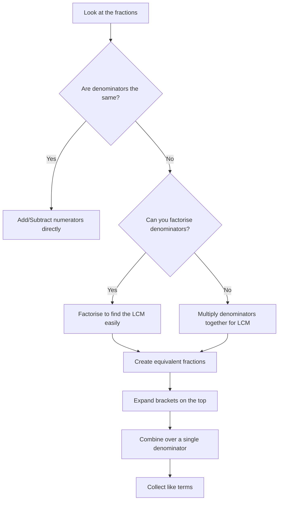

An algebraic fraction is a fraction that can be expressed in the form $\frac{a}{b}$, where $a$ and $b$ are algebraic expressions (e.g., $\frac{4x+3}{2x}$ or $\frac{3x^2-5x+1}{x+3}$). 

Algebraic fractions follow the exact same mathematical rules as numerical fractions. If you can simplify, add, subtract, multiply, and divide normal fractions, you already know how to handle algebraic ones. The only difference is that you are working with variables instead of just numbers.

---

## 1. Simplifying Algebraic Fractions

Simplifying requires factoring out the Highest Common Factor (HCF) from the numerator and denominator and reducing appropriately. Do this *before* you attempt any complex multiplication or division!

### Basic Simplification and Indices
When simplifying brackets with powers, use your index laws just like you would with single variables.

**Example A: Constant Factors**
$\frac{8(x-4)}{2} = 4(x-4)$
<SteveTip title="No Need to Expand!">
When you simplify a fraction and are left with brackets in the numerator or denominator, you usually do not need to expand them unless the question specifically asks for it. Leaving it as $4(x-4)$ is perfectly acceptable and safer!
</SteveTip>

**Example B: Identical Brackets**
$\frac{y-2}{y-2} = 1$
<Aside type="caution" title="It is NOT 0!">
A very common mistake when everything cancels out is to write $0$ as the answer. Remember, any number (or expression) divided by itself is $1$. 
</Aside>

**Example C: Cancelling with Indices**
$$
\begin{aligned}
&\quad \frac{-4(x+10)^5}{6(x+10)^8} \\
&= \frac{-2(x+10)^5}{3(x+10)^8} \quad \text{(Simplify the numerical coefficients)} \\
&= \frac{-2}{3(x+10)^3} \quad \text{(Subtract the indices: } 5 - 8 = -3 \text{)}
\end{aligned}
$$

### Simplifying Rational Expressions (Extended)
Sometimes you are given a large, complex algebraic fraction. You must **factorise fully first** before cancelling anything.

<Aside type="caution" title="The Illegal Cancellation">
Students often see an expression like $\frac{s^2}{s+3}$ and try to cancel the $s$ to get $\frac{s}{3}$. **This is mathematically illegal!** You cannot cancel terms that are under addition or subtraction. 
* $\frac{s^2}{s+3} \neq \frac{s}{3}$ ❌ (Addition prevents cancelling)
* $\frac{s^2}{s \times 3} = \frac{s}{3}$ ✅ (Multiplication allows cancelling)
</Aside>

**Example:** Factorise and simplify $\frac{x^2 - 2x}{x^2 - 5x + 6}$

**Step 1: Factorise the numerator.**
The top expression has a common factor of $x$.
$x^2 - 2x = x(x - 2)$

**Step 2: Factorise the denominator.**
The bottom expression is a quadratic trinomial. We need numbers that multiply to $+6$ and add to $-5$. These are $-2$ and $-3$.
$x^2 - 5x + 6 = (x - 2)(x - 3)$

**Step 3: Rewrite and cancel common factors.**
$$
\begin{aligned}
&\quad \frac{x^2 - 2x}{x^2 - 5x + 6} \\
&= \frac{x\cancel{(x - 2)}}{\cancel{(x - 2)}(x - 3)} \\
&= \frac{x}{x - 3}
\end{aligned}
$$

---

## 2. Multiplying and Dividing Algebraic Fractions

Multiplying and dividing are the easiest operations to perform on fractions because you do not need a common denominator.

### Multiplication
Multiply the numerators together, and multiply the denominators together. Simplify the result if possible.

<Aside type="note" title="Anatomy of Fraction Multiplication">
* **Top $\times$ Top:** Multiply the coefficients and add the indices of matching variables.
* **Bottom $\times$ Bottom:** Do the same for the denominators.
* **Simplify:** Cancel any common factors between the final numerator and denominator.
</Aside>

**Example:** Calculate $\frac{3a}{4} \times \frac{9a}{10}$

$$
\begin{aligned}
&\quad \frac{3a}{4} \times \frac{9a}{10} \\
&= \frac{3a \times 9a}{4 \times 10} \\
&= \frac{27a^2}{40}
\end{aligned}
$$

### Division
Never divide fractions directly. Instead, use the **Keep-Change-Flip** method: keep the first fraction, change the division sign to multiplication, and flip the second fraction (find its reciprocal).

**Example:** Calculate $\frac{3a}{4} \div \frac{9a}{10}$

$$
\begin{aligned}
&\quad \frac{3a}{4} \div \frac{9a}{10} \\
&= \frac{3a}{4} \times \frac{10}{9a} \quad \text{(Keep, Change, Flip)} \\
&= \frac{30a}{36a}
\end{aligned}
$$

Now, simplify the fraction. Both $30$ and $36$ are divisible by $6$, and the $a$ on the top and bottom cancel each other out.

$$
\begin{aligned}
&= \frac{5 \times \cancel{6a}}{6 \times \cancel{6a}} \\
&= \frac{5}{6}
\end{aligned}
$$

---

## 3. Adding and Subtracting Algebraic Fractions

To add or subtract algebraic fractions, you **must** find a common denominator. This is usually the Lowest Common Multiple (LCM) of the denominators.

### Basic Addition and Subtraction
**Example A:** Express $\frac{2x + 1}{3} - \frac{x + 5}{7}$ as a single fraction.
The common denominator for $3$ and $7$ is $21$. Multiply the top and bottom of each fraction to achieve this.

$$
\begin{aligned}
&\quad \frac{7(2x + 1)}{21} - \frac{3(x + 5)}{21} \\
&= \frac{14x + 7}{21} - \frac{3x + 15}{21} 
\end{aligned}
$$

<SteveTip title="The Invisible Brackets">
When subtracting a fraction with multiple terms in its numerator, treat that numerator as if it is wrapped in invisible brackets. The negative sign must distribute to **every** term inside! In the example above, you are subtracting positive $15$, which becomes $-15$.
</SteveTip>

$$
\begin{aligned}
&= \frac{14x + 7 - 3x - 15}{21} \\
&= \frac{11x - 8}{21}
\end{aligned}
$$

### Binomial Denominators (Extended)
When the denominators contain algebraic expressions, the LCM is usually the product of the two denominators. Leave the denominator factorised in your final answer!

**Example B:** Express $\frac{3}{x - 1} - \frac{2}{x + 1}$ as a single fraction.
The common denominator is $(x - 1)(x + 1)$.

$$
\begin{aligned}
&\quad \frac{3(x + 1)}{(x - 1)(x + 1)} - \frac{2(x - 1)}{(x - 1)(x + 1)} \\
&= \frac{3x + 3 - (2x - 2)}{(x - 1)(x + 1)} \\
&= \frac{3x + 3 - 2x + 2}{(x - 1)(x + 1)} \\
&= \frac{x + 5}{(x - 1)(x + 1)}
\end{aligned}
$$

### Factoring Denominators First (Extended)
Sometimes, you can factorise one of the denominators to find a much simpler LCM.

**Example C:** Express $\frac{5}{4x + 12} + \frac{3}{x + 3}$ as a single fraction.
Notice that $4x + 12$ can be factorised into $4(x + 3)$. 
This means the LCM is just $4(x + 3)$! We only need to multiply the second fraction by $\frac{4}{4}$.

$$
\begin{aligned}
&\quad \frac{5}{4(x + 3)} + \frac{3 \times 4}{(x + 3) \times 4} \\
&= \frac{5}{4(x + 3)} + \frac{12}{4(x + 3)} \\
&= \frac{17}{4(x + 3)}
\end{aligned}
$$

---

## 4. Practice Questions

<Tabs>
  <TabItem label="📝 Q1: Simplifying Fractions">
    Simplify the following completely:
    1. $\frac{10(x-2)^5}{15(x-2)^2}$
    2. $\frac{3x^2 - 12x}{x^2 - 16}$
  </TabItem>
  <TabItem label="✅ Solution 1">
    **1. Cancelling with Indices:**
    Simplify the numbers: $\frac{10}{15} = \frac{2}{3}$.
    Subtract the indices: $5 - 2 = 3$.
    **Answer:** $\frac{2(x-2)^3}{3}$
    
    **2. Factorise and Cancel:**
    Top (Extract HCF): $3x(x - 4)$
    Bottom (DOTS): $(x - 4)(x + 4)$
    Cancel the common $(x - 4)$ bracket.
    **Answer:** $\frac{3x}{x + 4}$
  </TabItem>
</Tabs>

<AIGenerator topic="Simplifying rational algebraic expressions using index laws, factorising quadratics, and DOTS" difficulty="IGCSE Extended" client:load />

<Tabs>
  <TabItem label="📝 Q2: Multiplying & Dividing">
    1. Simplify $\frac{4m}{5} \times \frac{15m}{8}$
    2. Simplify $\frac{7p}{12} \div \frac{14p^2}{3}$
  </TabItem>
  <TabItem label="✅ Solution 2">
    **1. Multiplication:**
    $$
    \begin{aligned}
    &\quad \frac{4m \times 15m}{5 \times 8} \\
    &= \frac{60m^2}{40} \\
    &= \frac{3m^2}{2}
    \end{aligned}
    $$
    
    **2. Division:**
    $$
    \begin{aligned}
    &\quad \frac{7p}{12} \times \frac{3}{14p^2} \\
    &= \frac{21p}{168p^2} \\
    &= \frac{1}{8p}
    \end{aligned}
    $$
  </TabItem>
</Tabs>

<AIGenerator topic="Multiplying and dividing simple algebraic fractions" difficulty="IGCSE Core" client:load />

<Tabs>
  <TabItem label="📝 Q3: Adding/Subtracting Fractions">
    Express as a single fraction in its simplest form:
    1. $\frac{2x - 1}{4} + \frac{x + 3}{5}$
    2. $\frac{3y + 2}{3} - \frac{y - 4}{4}$
  </TabItem>
  <TabItem label="✅ Solution 3">
    **1. Addition (LCM = 20):**
    $$
    \begin{aligned}
    &\quad \frac{5(2x - 1)}{20} + \frac{4(x + 3)}{20} \\
    &= \frac{10x - 5 + 4x + 12}{20} \\
    &= \frac{14x + 7}{20}
    \end{aligned}
    $$

    **2. Subtraction (LCM = 12):** Watch the negative sign!
    $$
    \begin{aligned}
    &\quad \frac{4(3y + 2)}{12} - \frac{3(y - 4)}{12} \\
    &= \frac{12y + 8 - 3(y - 4)}{12} \\
    &= \frac{12y + 8 - 3y + 12}{12} \\
    &= \frac{9y + 20}{12}
    \end{aligned}
    $$
  </TabItem>
</Tabs>

<AIGenerator topic="Adding and subtracting algebraic fractions with numerical denominators" difficulty="IGCSE Core" client:load />

<Tabs>
  <TabItem label="📝 Q4: Binomial Denominators (Extended)">
    Express as a single fraction in its simplest form:
    $\frac{4}{x + 2} - \frac{5}{x - 3}$
  </TabItem>
  <TabItem label="✅ Solution 4">
    The common denominator is $(x + 2)(x - 3)$.
    $$
    \begin{aligned}
    &\quad \frac{4(x - 3)}{(x + 2)(x - 3)} - \frac{5(x + 2)}{(x + 2)(x - 3)} \\
    &= \frac{4x - 12 - 5(x + 2)}{(x + 2)(x - 3)} \\
    &= \frac{4x - 12 - 5x - 10}{(x + 2)(x - 3)} \\
    &= \frac{-x - 22}{(x + 2)(x - 3)} \quad \text{or} \quad \frac{-(x + 22)}{(x + 2)(x - 3)}
    \end{aligned}
    $$
  </TabItem>
</Tabs>

<AIGenerator topic="Adding and subtracting algebraic fractions with binomial denominators" difficulty="IGCSE Extended" client:load />

<Tabs>
  <TabItem label="📝 Q5: Factoring Denominators First (Extended)">
    Express as a single fraction in its simplest form:
    $\frac{7}{3x - 6} + \frac{2}{x - 2}$
  </TabItem>
  <TabItem label="✅ Solution 5">
    Notice that $3x - 6$ factorises to $3(x - 2)$.
    Therefore, the LCM is $3(x - 2)$. We only need to multiply the second fraction by $\frac{3}{3}$.
    $$
    \begin{aligned}
    &\quad \frac{7}{3(x - 2)} + \frac{2 \times 3}{3(x - 2)} \\
    &= \frac{7}{3(x - 2)} + \frac{6}{3(x - 2)} \\
    &= \frac{13}{3(x - 2)}
    \end{aligned}
    $$
  </TabItem>
</Tabs>

<AIGenerator topic="Adding and subtracting algebraic fractions by factoring denominators to find the LCM" difficulty="IGCSE Extended" client:load />