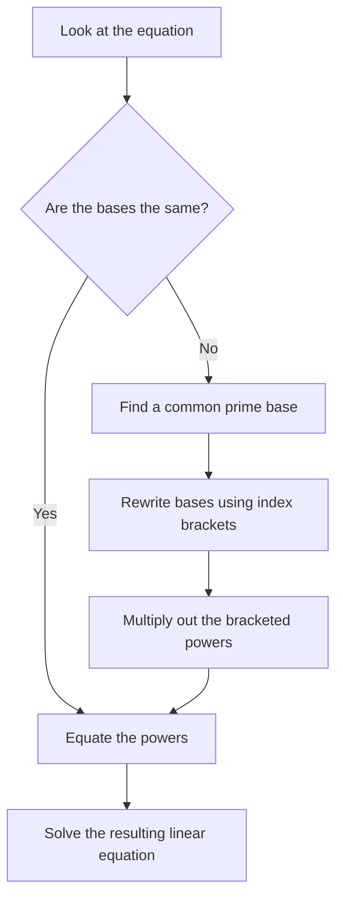

Indices (or powers) are a shorthand way of showing how many times a number or variable is multiplied by itself. In this extended section, we move beyond basic positive whole-number powers and explore what happens when an index is zero, negative, or a fraction.

---

## 1. The Rules of Indices

You must be completely fluent in the laws of indices. They apply exactly the same way whether the power is a whole number, a negative number, or a fraction.

### The Basic Laws (Recap)
* **Multiplication:** $a^m \times a^n = a^{m+n}$ *(Add the powers)*
* **Division:** $a^m \div a^n = a^{m-n}$ *(Subtract the powers)*
* **Brackets:** $(a^m)^n = a^{m \times n}$ *(Multiply the powers)*

### The Extended Laws
<Aside type="note" title="Zero, Negative, and Fractional Indices">
* **Zero Index:** Anything to the power of zero is $1$. 
  $$a^0 = 1$$
* **Negative Index:** A negative power means the reciprocal (flip the fraction). It does **not** make the number itself negative!
  $$a^{-n} = \frac{1}{a^n} \quad \text{and} \quad \left(\frac{a}{b}\right)^{-n} = \left(\frac{b}{a}\right)^n$$
* **Fractional Index:** The denominator is the root, and the numerator is the power.
  $$a^{\frac{1}{n}} = \sqrt[n]{a} \quad \text{and} \quad a^{\frac{m}{n}} = (\sqrt[n]{a})^m$$
</Aside>

---

## 2. Simplifying Complex Algebraic Indices

When simplifying expressions with multiple terms, deal with the **numbers (coefficients)** first, then deal with the **letters (variables)** one by one using the index laws.

**Example 1: Multiplying with fractional indices**
Simplify $x^{\frac{2}{3}} \times x^{-\frac{1}{3}}$

$$
\begin{aligned}
&\quad x^{\frac{2}{3}} \times x^{-\frac{1}{3}} \\
&= x^{\frac{2}{3} + (-\frac{1}{3})} \\
&= x^{\frac{1}{3}}
\end{aligned}
$$

**Example 2: Negative indices and brackets**
Simplify $\left( \frac{x^2}{x^5} \right)^{-2}$

$$
\begin{aligned}
&\quad \left( \frac{x^2}{x^5} \right)^{-2} \\
&= (x^{2 - 5})^{-2} \quad \text{(Simplify inside the bracket first!)} \\
&= (x^{-3})^{-2} \\
&= x^{-3 \times -2} \\
&= x^6
\end{aligned}
$$

<SteveTip title="Power of a Power with Coefficients">
When an expression in a bracket is raised to a power, **everything** inside gets the power, including the numbers! 
$(3x^4)^2$ is NOT $3x^8$. It is $3^2 \times (x^4)^2 = 9x^8$.
</SteveTip>

**Example 3: Fractional powers of mixed expressions**
Simplify $(32x^{10})^{\frac{2}{5}}$

$$
\begin{aligned}
&\quad (32x^{10})^{\frac{2}{5}} \\
&= 32^{\frac{2}{5}} \times (x^{10})^{\frac{2}{5}} \\
&= (\sqrt[5]{32})^2 \times x^{10 \times \frac{2}{5}} \\
&= (2)^2 \times x^4 \\
&= 4x^4
\end{aligned}
$$

---

## 3. Solving Exponential Equations

An exponential equation is an equation where the unknown variable ($x$) is in the power. To solve these, you must make the **bases the same** on both sides of the equals sign.

**Example 1: Finding a common base**
Solve $32^x = 2$

1. Recognise that both 32 and 2 are powers of 2. ($32 = 2^5$)
2. Substitute $2^5$ in place of $32$.

$$
\begin{aligned}
(2^5)^x &= 2^1 \\
2^{5x} &= 2^1
\end{aligned}
$$

3. Since the bases are now the same, the powers must be equal.

$$
\begin{aligned}
5x &= 1 \\
x &= \frac{1}{5}
\end{aligned}
$$

**Example 2: Variables on both sides**
Solve $5^{x+1} = 25^x$

1. Recognise that 25 is a power of 5. ($25 = 5^2$)
2. Substitute $5^2$ in place of $25$. Keep the original $x$ outside the bracket.

$$
\begin{aligned}
5^{x+1} &= (5^2)^x \\
5^{x+1} &= 5^{2x}
\end{aligned}
$$

3. The bases are the same, so equate the powers:

$$
\begin{aligned}
x + 1 &= 2x \\
1 &= 2x - x \\
x &= 1
\end{aligned}
$$

---

## 4. Practice Questions

<Tabs>
  <TabItem label="📝 Q1: Evaluating Indices">
    Evaluate the following (find the numerical value):
    1. $7^0$
    2. $5^{-2}$
    3. $81^{\frac{3}{4}}$
  </TabItem>
  <TabItem label="✅ Solution 1">
    **1. Zero Index:**
    $7^0 = 1$
    
    **2. Negative Index:**
    $$5^{-2} = \frac{1}{5^2} = \frac{1}{25}$$

    **3. Fractional Index:**
    The denominator is 4 (fourth root). The numerator is 3 (cube it).
    $$81^{\frac{3}{4}} = (\sqrt[4]{81})^3$$
    $$= (3)^3 = 27$$
  </TabItem>
</Tabs>

<AIGenerator topic="Evaluating numerical expressions with zero, negative, and fractional indices" difficulty="IGCSE Extended" client:load />

<Tabs>
  <TabItem label="📝 Q2: Simplifying Algebraic Indices">
    Simplify the following completely:
    1. $2x^{\frac{1}{2}} \times 4x^{\frac{3}{2}}$
    2. $\left( \frac{27a^6}{b^9} \right)^{\frac{1}{3}}$
  </TabItem>
  <TabItem label="✅ Solution 2">
    **1. Multiplication:**
    Multiply the numbers: $2 \times 4 = 8$
    Add the powers: $\frac{1}{2} + \frac{3}{2} = \frac{4}{2} = 2$
    **Answer:** $8x^2$

    **2. Fractional Power of a Bracket:**
    Apply the power of $\frac{1}{3}$ (which means cube root) to every single element.
    $$
    \begin{aligned}
    &\quad \frac{27^{\frac{1}{3}} \times (a^6)^{\frac{1}{3}}}{(b^9)^{\frac{1}{3}}} \\
    &= \frac{\sqrt[3]{27} \times a^{6 \times \frac{1}{3}}}{b^{9 \times \frac{1}{3}}} \\
    &= \frac{3a^2}{b^3}
    \end{aligned}
    $$
  </TabItem>
</Tabs>

<AIGenerator topic="Simplifying complex algebraic expressions involving negative and fractional indices" difficulty="IGCSE Extended" client:load />

<Tabs>
  <TabItem label="📝 Q3: Solving Exponential Equations">
    Solve the following equations for $x$:
    1. $9^x = 27$
    2. $4^{2x - 1} = 8^{x}$
  </TabItem>
  <TabItem label="✅ Solution 3">
    **1. $9^x = 27$**
    Both are powers of 3. ($9 = 3^2$ and $27 = 3^3$)
    $$
    \begin{aligned}
    (3^2)^x &= 3^3 \\
    3^{2x} &= 3^3 \\
    2x &= 3 \\
    x &= 1.5 \quad \text{(or } \frac{3}{2})
    \end{aligned}
    $$

    **2. $4^{2x - 1} = 8^{x}$**
    Both are powers of 2. ($4 = 2^2$ and $8 = 2^3$)
    $$
    \begin{aligned}
    (2^2)^{2x - 1} &= (2^3)^x \\
    2^{2(2x - 1)} &= 2^{3x} \\
    2^{4x - 2} &= 2^{3x}
    \end{aligned}
    $$
    Equate the powers:
    $$
    \begin{aligned}
    4x - 2 &= 3x \\
    4x - 3x &= 2 \\
    x &= 2
    \end{aligned}
    $$
  </TabItem>
</Tabs>

<AIGenerator topic="Solving exponential equations by equating bases" difficulty="IGCSE Extended" client:load />