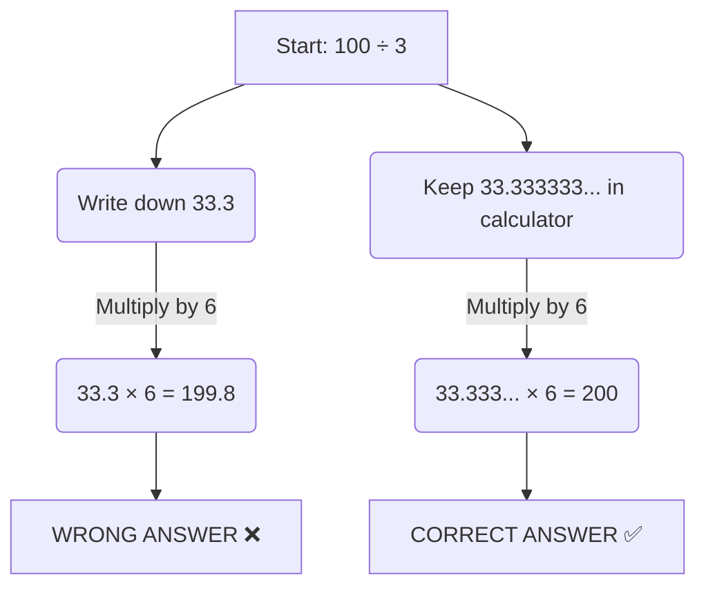

Your scientific calculator is the most powerful tool in your maths kit, but it is only as smart as the person typing the buttons. Misunderstanding how your calculator interprets data or displays answers is a common way to lose easy marks.

---

## 1. Efficient Calculator Use

Typing every single calculation out step-by-step and hitting equals after every operation is slow and leads to mistakes. Modern scientific calculators allow you to type the calculation *exactly* as it appears on the exam paper.

* **The Fraction Button:** Always use the fraction button (usually showing two boxes on top of each other) rather than the division symbol ($\div$) for complex algebraic or numerical fractions. This ensures the calculator groups the top (numerator) and bottom (denominator) correctly.
  * *Example:* To calculate $\frac{4.5 + 2.1}{3.2^2}$, press the fraction button first, type $4.5 + 2.1$ on the top, use the down arrow to navigate to the denominator, and type $3.2^2$ on the bottom.
  * **TI-Nspire Users:** You can quickly access the fraction template by pressing **Ctrl + $\div$**. When entering **mixed numbers** (like $9\frac{1}{2}$), do *not* type the whole number directly next to the fraction, as the calculator will think you are trying to multiply. Instead, use brackets and a plus sign: `(9 + 1/2)`.
* **Negative vs. Subtract (GDC Warning):** Graphing Display Calculators (like the TI-Nspire or TI-84) are very picky about the difference between the **negative** button `(-)` and the **subtraction** button `-`. Using the subtraction button to make a starting number negative will often result in a "Syntax Error".
* **Brackets:** If a calculation involves squaring a negative number, always use brackets. Typing `-5²` will often give **-25** (because it squares the 5, then applies the negative), but typing `(-5)²` will correctly give **25**.
* **Standard Form to Decimal (The "S↔D" or "Piggy Nose" Button):** * On a Casio, use the **S↔D** button.
  * On a Texas Instruments (TI) scientific calculator, use the **◀▶** button (which I call the "piggy nose" button). 
  * **TI-Nspire Users:** To force a decimal approximation, press **Ctrl + Enter**. To convert a decimal back into a fraction, you must select it from the menu: **Menu > Number > Approximate to Fraction**.

---

## 2. The Golden Rule: Never Round Early

One of the most frequent causes of dropped marks is rounding numbers halfway through a calculation. **You must only round your final answer.**

If you round early, that tiny inaccuracy multiplies with every subsequent step, throwing your final answer completely off course. 

### How to avoid early rounding:
1. **Type it all at once:** Enter the entire equation into the calculator in one go.
2. **Use the `ANS` key (Casio/Standard TI):** If you must do a calculation in steps, use the `ANS` (Answer) button. This recalls the exact, unrounded value of your previous calculation to use in the next step.

<Aside type="danger" title="TI-Nspire Warning: The ANS Trap">
Be very careful using the `Ans` feature on a TI-Nspire. If you calculate the square root of your previous answer (e.g., `√Ans`) and then press `Ctrl + Enter` to turn it into a decimal, the calculator will sometimes re-evaluate the square root *again*! 
**The Safer Method:** Use the **Up arrow** on the directional pad to highlight the exact previous answer, then press **Enter** to copy it down onto your current line.
</Aside>

<Aside type="caution" title="Exam Tip: Show Your Working">
Even though you are keeping the exact number in your calculator, you should still write down the intermediate numbers on your exam paper (e.g., write down 33.33...) so the examiner can see your logic!
</Aside>

---

## 3. Interpreting the Display

Calculators are strictly mathematical; they do not understand real-world context like currency or hours unless you tell them to. 

### Money (Adding the Zero)
If a question involves currency (£ or $), a calculator will drop trailing zeros because 4.8 is mathematically identical to 4.80.
* **Calculator Display:** `4.8`
* **Your Written Answer:** **£4.80** (Money must always be written to two decimal places).

### Time (The Decimal Trap)
Time is based on 60, not 100. A decimal of a time does NOT directly translate to minutes!

* **Calculator Display:** `3.25 hours`
* **The Trap:** Do not write "3 hours and 25 minutes". 
* **The Fix:** The decimal `0.25` represents a quarter of an hour. Multiply the decimal part by 60 to find the exact minutes: $0.25 \times 60 = 15$. 
* **Your Written Answer:** **3 hours 15 minutes**.

<SteveTip title="The Time Button (Degrees, Minutes, Seconds)">
You can completely bypass the decimal trap by using the Degrees, Minutes, Seconds button (usually marked as **° ' "**). 
To enter 2 hours and 30 minutes, you can type **2.5** (since 30 mins is half an hour), OR you can type **2 [° ' "] 30 [° ' "] 0 [° ' "]**. 
If your calculator gives you an answer in decimals, pressing the **° ' "** button will instantly convert it into Hours, Minutes, and Seconds!
</SteveTip>

---

## 4. Standard Practice Problems

<Tabs>
  <TabItem label="📝 Question 1: Money">
    Calculate £12.50 divided by 4. Write down the exact amount you would tell a customer to pay.
  </TabItem>
  <TabItem label="✅ Solution 1">
    1. Calculator output: `3.125`.
    2. Context: We are dealing with money, which only has two decimal places (pence).
    3. Rounding: 3.125 rounds up to 3.13.
    **Answer:** £3.13
  </TabItem>
</Tabs>

<AIGenerator course="IGCSE" storageKey="igcse_math_history" topic="Interpreting calculator money displays and rounding to 2 decimal places" difficulty="IGCSE Core" client:load />

<Tabs>
  <TabItem label="📝 Question 2: Time">
    A train journey takes exactly 285 minutes. Convert this into hours and minutes using your calculator.
  </TabItem>
  <TabItem label="✅ Solution 2">
    1. Divide by 60 to find the hours: $285 \div 60 = 4.75$.
    2. We have 4 full hours. 
    3. Take the decimal remainder (0.75) and multiply by 60 to find the minutes: $0.75 \times 60 = 45$.
    *(Alternatively, use the ° ' " button on your calculator!)*
    **Answer:** 4 hours 45 minutes
  </TabItem>
</Tabs>

<AIGenerator course="IGCSE" storageKey="igcse_math_history" topic="Converting decimal time to hours and minutes" difficulty="IGCSE Core" client:load />

<Tabs>
  <TabItem label="📝 Question 3: Early Rounding">
    Calculate the area of a circle with a radius of 5.5cm. Then, multiply that area by 12. Give your final answer to 1 decimal place.
  </TabItem>
  <TabItem label="✅ Solution 3">
    1. Area = $\pi \times 5.5^2 = 95.03317...$
    2. **DO NOT** clear your calculator or type in 95.0. 
    3. Immediately press `× 12` to use the unrounded exact value (or use the Up arrow on an Nspire to copy it).
    4. Exact calculation: $95.03317... \times 12 = 1140.3981...$
    5. Now, round to 1 decimal place.
    **Answer:** 1140.4 cm²
  </TabItem>
</Tabs>

<AIGenerator course="IGCSE" storageKey="igcse_math_history" topic="Multi-step calculations using exact values and avoiding early rounding" difficulty="IGCSE Extended" client:load />

<Tabs>
  <TabItem label="📝 Question 4: Fractions & Negatives">
    Calculate the exact value of $\frac{-8.4 + 2.6}{0.5}$. Give your answer as a decimal.
  </TabItem>
  <TabItem label="✅ Solution 4">
    1. Press the fraction button.
    2. On the top, use the **negative** button `(-)` (not the subtract button) to type `-8.4 + 2.6`.
    3. On the bottom, type `0.5`.
    4. Press equals, then use the S↔D or ◀▶ button to convert to a decimal.
    **Answer:** -11.6
  </TabItem>
</Tabs>

<AIGenerator course="IGCSE" storageKey="igcse_math_history" topic="Calculating complex fractions with negative numbers on a GDC" difficulty="IGCSE Core" client:load />

---

## 5. Looking Ahead: Advanced Calculator Skills

You haven't covered these topics yet, but they will become huge parts of your maths journey later this year. Try typing these into your calculator now to get a feel for the more advanced buttons!

<Tabs>
  <TabItem label="📐 Pythagoras Preview">
    Calculate the exact length of the longest side of a right-angled triangle with shorter sides of 5cm and 12cm by typing this exactly as it appears: 
    $\sqrt{5^2 + 12^2}$
  </TabItem>
  <TabItem label="✅ Pythagoras Solution">
    1. Press the square root button first `√`.
    2. Type `5` then the squared button `x²`.
    3. Type `+`.
    4. Type `12` then the squared button `x²`.
    5. Hit equals (or enter). The calculator does all the order of operations for you!
    **Answer:** 13
  </TabItem>
</Tabs>

<Tabs>
  <TabItem label="🌊 Trigonometry Preview">
    Find the length of a side of a triangle by typing this trigonometric function exactly as it appears (make sure your calculator is in "Degrees" or "Deg" mode!):
    $15 \times \sin(42^\circ)$
  </TabItem>
  <TabItem label="✅ Trigonometry Solution">
    1. Type `15 \times`.
    2. Press the `sin` button.
    3. Type `42` and make sure to close the bracket `)`.
    4. Hit equals to get the long decimal, then round it to 1 decimal place.
    **Answer:** 10.0 (from 10.0369...)
  </TabItem>
</Tabs>