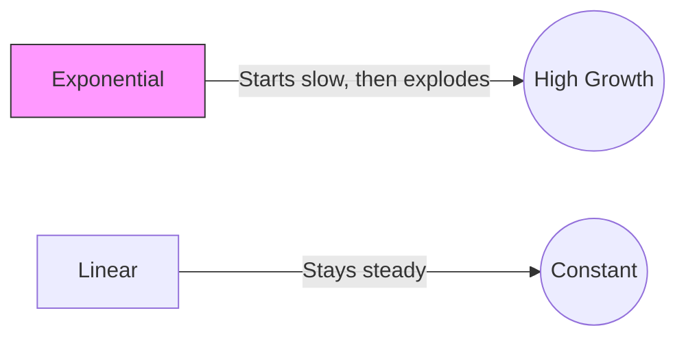

In the real world, things rarely change by the same fixed amount every year. Instead, they change by a **percentage** of their current value. This creates **Exponential Growth** (speeding up) or **Exponential Decay** (slowing down).

---

## 1. The Exponential Formula

While you can calculate change year-by-year, it is much faster to use the general formula. You do not need to know the constant $e$ for IGCSE; we use the **multiplier method**.

$$Value = P \times (\text{multiplier})^n$$

* **$P$**: The initial amount (Principal).
* **Multiplier**: The percentage change expressed as a decimal ($1 + r$ for growth, $1 - r$ for decay).
* **$n$**: The number of time periods (usually years).

---

## 2. Exponential Growth (Population)

Growth occurs when the multiplier is greater than 1. This is commonly seen in population studies or bacterial growth.

**Example:** A town has a population of 25,000. The population grows at a rate of 3% per year. Calculate the population after 12 years.

1.  **Identify the multiplier:** $100\% + 3\% = 103\% \rightarrow \mathbf{1.03}$
2.  **Set up the equation:** $25,000 \times (1.03)^{12}$
3.  **Calculate:** $25,000 \times 1.42576... = 35,644.02...$
4.  **Round to context:** You cannot have 0.02 of a person! 
    **Answer:** 35,644 people.

<SteveTip title="Linear vs Exponential">
If the question says "The population increases by 500 people every year," that is **Linear**. You just add.
If the question says "The population increases by 2% every year," that is **Exponential**. You must use powers!
</SteveTip>

---

## 3. Exponential Decay (Depreciation)

Decay occurs when the multiplier is less than 1. The most common exam example is **Depreciation**—the loss of value in an item like a car or a computer.

**Example:** A car is bought for £18,000. It depreciates at a rate of 15% per year. Find its value after 4 years.

1.  **Identify the multiplier:** $100\% - 15\% = 85\% \rightarrow \mathbf{0.85}$
2.  **Set up the equation:** $18,000 \times (0.85)^4$
3.  **Calculate:** $18,000 \times 0.522 = 9396$
    **Answer:** £9,396

---

## 4. Comparing Growth Models

Sometimes you are asked to compare two different investments or populations to see which is "better" over time.

| Feature | Linear (Simple) | Exponential (Compound) |
| :--- | :--- | :--- |
| **Change** | Fixed amount (e.g., +$50) | Percentage (e.g., +5%) |
| **Graph Shape** | Straight line | Curved line |
| **Formula** | $P + (n \times d)$ | $P \times (\text{multiplier})^n$ |

---

## 5. Standard Practice Problems

<Tabs>
  <TabItem label="📝 Question 1: Population">
    The number of bacteria in a colony doubles every hour. If there are 500 bacteria initially, how many will there be after 8 hours?
  </TabItem>
  <TabItem label="✅ Solution 1">
    1. "Doubles" means an increase of 100%, so the multiplier is **2**.
    2. Calculation: $500 \times 2^8$
    3. $500 \times 256 = 128,000$
    **Answer:** 128,000 bacteria
  </TabItem>
</Tabs>

<AIGenerator course="IGCSE" storageKey="igcse_math_history" topic="Exponential growth in populations and bacteria" difficulty="IGCSE Core" client:load />

<Tabs>
  <TabItem label="📝 Question 2: Depreciation">
    A laptop costs £800. Its value depreciates by 25% each year. Calculate its value after 3 years.
  </TabItem>
  <TabItem label="✅ Solution 2">
    1. Multiplier: $1 - 0.25 = 0.75$
    2. Calculation: $800 \times (0.75)^3$
    3. $800 \times 0.421875 = 337.5$
    **Answer:** £337.50
  </TabItem>
</Tabs>

<AIGenerator course="IGCSE" storageKey="igcse_math_history" topic="Exponential decay and asset depreciation" difficulty="IGCSE Core" client:load />

<Tabs>
  <TabItem label="📝 Question 3: Solving for 'n'">
    A rare stamp is worth £500. Its value increases by 10% each year. Find the number of **full years** it takes for the value to exceed £800.
  </TabItem>
  <TabItem label="✅ Solution 3">
    1. Equation: $500 \times (1.1)^n > 800$
    2. Use trial and improvement:
       * $n=4: 500 \times 1.1^4 = 732.05$
       * $n=5: 500 \times 1.1^5 = 805.26$
    **Answer:** 5 years
  </TabItem>
</Tabs>

<AIGenerator course="IGCSE" storageKey="igcse_math_history" topic="Solving exponential inequalities using trial and improvement" difficulty="IGCSE Extended" client:load />