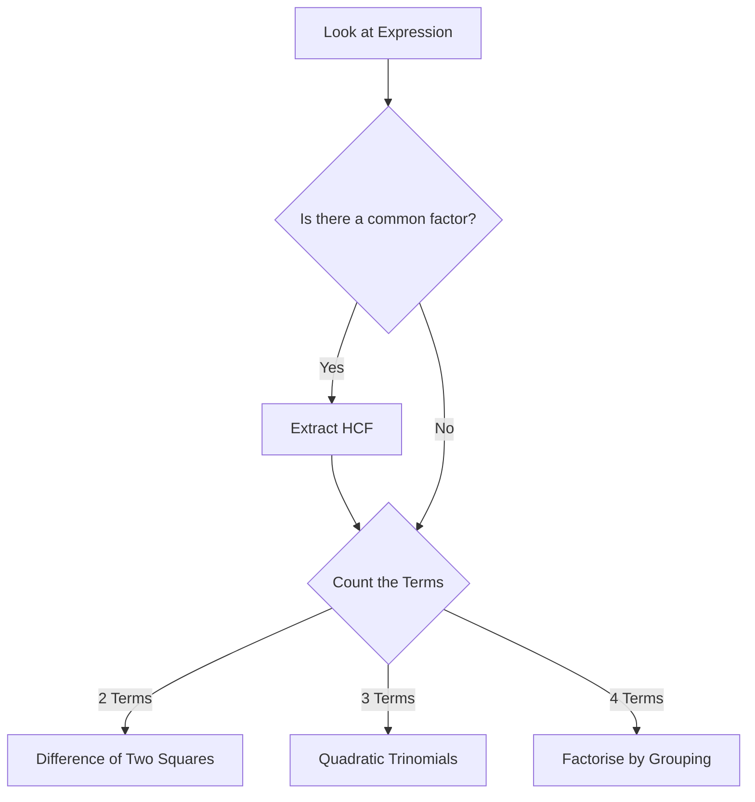

Algebra is the language of mathematics. Before solving equations or working with complex functions, you must be able to fluently manipulate algebraic expressions. This means mastering how to simplify, expand, and factorise them efficiently.

---

## 1. Simplifying Expressions

To simplify an algebraic expression, you must collect **like terms**. Like terms are terms that have exactly the same variables with the exact same powers. 

<Aside type="note" title="Anatomy of an Algebraic Expression">
* **Terms:** The individual chunks separated by $+$ or $-$ signs.
* **Coefficients:** The numerical values multiplying the variables (e.g., the $5$ in $5x^2$).
* **Variables:** The letters representing unknown values.
* **Constants:** Plain numbers without any variables attached.
</Aside>

When simplifying, look for matching letter combinations and combine their coefficients. Present your working vertically to avoid losing track of signs.

**Example:**
Simplify $2a^2 + 3ab - 1 + 5a^2 - 9ab + 4$

$$
\begin{aligned}
&\quad 2a^2 + 3ab - 1 + 5a^2 - 9ab + 4 \\
&= (2a^2 + 5a^2) + (3ab - 9ab) + (-1 + 4) \\
&= 7a^2 - 6ab + 3
\end{aligned}
$$

---

## 2. Expanding Products

Expanding an expression means removing the brackets by multiplying out the terms. 

### Single and Double Brackets
For double brackets, multiply every term in the first bracket by every term in the second bracket. The FOIL method (First, Outer, Inner, Last) is a common way to remember this.

**Example:** $(3x + y)(x - 4y)$

$$
\begin{aligned}
&\quad (3x + y)(x - 4y) \\
&= 3x(x) + 3x(-4y) + y(x) + y(-4y) \\
&= 3x^2 - 12xy + xy - 4y^2 \\
&= 3x^2 - 11xy - 4y^2
\end{aligned}
$$

<Aside type="caution" title="The Universal Algebra Mistake">
A very common misconception is thinking that $(x + y)^2 = x^2 + y^2$. **This is completely wrong!** A squared bracket means multiplying the bracket by itself.
$$
\begin{aligned}
(3x + 4)^2 &= (3x + 4)(3x + 4) \\
&= 9x^2 + 12x + 12x + 16 \\
&= 9x^2 + 24x + 16
\end{aligned}
$$
</Aside>

### Triple Brackets (Extended)
To expand three brackets, expand and simplify the first two brackets completely, then multiply that resulting expression by the third bracket.

---

## 3. Factorisation: The Basics

Factorising is the exact opposite of expanding. It means putting expressions back into brackets. Always start by extracting the **Highest Common Factor (HCF)**.

**Example:** Factorise $18m^3n - 24m^2n^2$

$$
\begin{aligned}
&\quad 18m^3n - 24m^2n^2 \\
&= 6m^2n(3m) - 6m^2n(4n) \\
&= 6m^2n(3m - 4n)
\end{aligned}
$$

<SteveTip title="Factorise Fully">
When an exam question says "factorise fully", it means you must extract the **Highest Common Factor**. If you factorised $9x^2 + 15xy$ into $x(9x + 15y)$, you would lose a mark because the terms inside the bracket still share a factor of $3$. Always double-check your brackets!
</SteveTip>

---

## 4. Advanced Factorisation

As expressions become more complex, you must recognise different patterns to factorise them correctly. Many students struggle here, so we will break down each method step-by-step. Use this flowchart to decide your strategy:

### A. Factorising by Grouping (4 Terms)
When you have four terms, split them down the middle into pairs and factorise each pair separately.

**Example:** Factorise $px - qx + 2py - 2qy$

$$
\begin{aligned}
&\quad px - qx \quad | \quad + 2py - 2qy \\
&= x(p - q) \quad + 2y(p - q) \\
&= (p - q)(x + 2y)
\end{aligned}
$$
*Notice how $(p - q)$ appears twice? Extract the entire bracket as the new common factor.*

### B. Difference of Two Squares (2 Terms)
<Aside type="tip" title="Difference of Two Squares (DOTS) Theorem">
Any expression showing the subtraction of two perfect squares, in the form $a^2 - b^2$, can always be factorised as $(a - b)(a + b)$.
</Aside>

**Example:** $36x^2 - 49y^2$

$$
\begin{aligned}
&\quad 36x^2 - 49y^2 \\
&= (6x)^2 - (7y)^2 \\
&= (6x - 7y)(6x + 7y)
\end{aligned}
$$

<Aside type="caution" title="The Sum of Squares Trap">
While $a^2 - b^2$ factorises easily, an expression like $a^2 + b^2$ **cannot be factorised** with real numbers. If you see a plus sign between two squares, stop! You cannot use the DOTS method.
</Aside>

### C. Quadratics: $x^2 + bx + c$ (Sum & Product Method)
When the coefficient of $x^2$ is 1 (e.g., $x^2 + 7x + 12$), we need to find two integers, $p$ and $q$, such that:
* **Product:** $p \times q = c$
* **Sum:** $p + q = b$

<SteveTip title="Check Products First!">
It is much easier to list the product factor pairs first because there is a finite number of pairs that multiply to make $c$. There are infinite ways to sum to $b$! You can stop making your list as soon as you find the correct pair.
</SteveTip>

**Example 1:** Factorise $x^2 + 7x + 12$
We need numbers that multiply to $+12$ and add to $+7$.

| Product Pairs of $12$ | Sum to $7$ |
| :---: | :---: |
| $1, 12$ | $13$ |
| $2, 6$ | $8$ |
| **$3, 4$** | **$7$** ✅ |

$$
\begin{aligned}
&\quad x^2 + 7x + 12 \\
&= (x + 3)(x + 4)
\end{aligned}
$$

<Aside type="tip" title="Sign Rules for Quadratics">
* If $c$ is positive: Both numbers have the *same sign* (both positive or both negative, depending on $b$).
* If $c$ is negative: One number is positive and the other is negative. The larger number takes the sign of $b$.
</Aside>

**Example 2:** Factorise $x^2 - x - 20$
Multiply to $-20$, Add to $-1$. (Since $c$ is negative, signs are mixed).

| Product Pairs of $-20$ | Sum to $-1$ |
| :---: | :---: |
| $1, -20$ | $-19$ |
| $2, -10$ | $-8$ |
| **$4, -5$** | **$-1$** ✅ |

$$
\begin{aligned}
&\quad x^2 - x - 20 \\
&= (x + 4)(x - 5)
\end{aligned}
$$

### D. Advanced Quadratics: $ax^2 + bx + c$ (Extended)
When the $x^2$ term has a number in front of it (and it isn't a common factor), you must use either the **AC Method** or the **Cross Method**.

#### Method 1: The AC Method (Splitting the Middle Term)
This is the most reliable algebraic method. You multiply $a \times c$, find factors of that number that sum to $b$, and use them to split the middle term into four terms. Then, factorise by grouping.

**Example:** Factorise $12x^2 - 37x + 21$
1. Find $ac$: $12 \times 21 = 252$
2. Find $b$: $-37$
3. We need factors of $252$ that add to $-37$. Because $252$ is positive and $-37$ is negative, both factors must be negative.

| Product Pairs of $252$ | Sum to $-37$ |
| :---: | :---: |
| $-2, -126$ | $-128$ |
| $-4, -63$ | $-67$ |
| $-6, -42$ | $-48$ |
| **$-9, -28$** | **$-37$** ✅ |

4. Split the middle term ($-37x$) into $-9x$ and $-28x$, then factorise by grouping:

$$
\begin{aligned}
&\quad 12x^2 - 37x + 21 \\
&= 12x^2 - 9x - 28x + 21 \\
&= 3x(4x - 3) - 7(4x - 3) \\
&= (3x - 7)(4x - 3)
\end{aligned}
$$

#### Method 2: The Cross Method
If you are good at mental math, the cross method is faster. You test factors of the first term ($a$) and factors of the last term ($c$) visually.

Using the same example: $12x^2 - 37x + 21$
* Factors of $12x^2$: Try $3x$ and $4x$.
* Factors of $21$: Try $-7$ and $-3$ (must be negative to get a negative middle term).
* Cross-multiply to check if the sum equals the middle term ($-37x$).

$$
\begin{array}{c c c c c}
3x & & -7 & \longrightarrow & -28x \\
& \times & & & \\
4x & & -3 & \longrightarrow & -9x \\
\hline
& & & & -37x \text{ (It works!)}
\end{array}
$$
Read straight across the rows to get your brackets: $(3x - 7)(4x - 3)$.

### E. Cubics & Hidden Quadratics (Extended)
Always look for an HCF first. Sometimes, pulling out an $x$ will reveal a quadratic hidden inside!

**Example:** Factorise $5x^3 + 30x^2 + 45x$

$$
\begin{aligned}
&\quad 5x^3 + 30x^2 + 45x \\
&= 5x(x^2 + 6x + 9) \\
&= 5x(x + 3)(x + 3) \\
&= 5x(x + 3)^2
\end{aligned}
$$

---

## 5. Practice Questions

<Tabs>
  <TabItem label="📝 Q1: Simplifying">
    Simplify the expression fully: 
    $4p^2 - 3pq + 7 - 2p^2 + 8pq - 12$
  </TabItem>
  <TabItem label="✅ Solution 1">
    $$
    \begin{aligned}
    &\quad 4p^2 - 3pq + 7 - 2p^2 + 8pq - 12 \\
    &= (4p^2 - 2p^2) + (-3pq + 8pq) + (7 - 12) \\
    &= 2p^2 + 5pq - 5
    \end{aligned}
    $$
  </TabItem>
</Tabs>

<AIGenerator course="IGCSE" storageKey="igcse_math_history" topic="Simplifying algebraic expressions by collecting like terms" difficulty="IGCSE Core" client:load />

<Tabs>
  <TabItem label="📝 Q2: Expanding Brackets">
    Expand and simplify:
    1. $4a(3a - 5b)$
    2. $(2x + 3y)(x - 5y)$
    3. $(x - 2)(x + 3)(2x + 1)$
  </TabItem>
  <TabItem label="✅ Solution 2">
    **1. Single Bracket:**
    $$12a^2 - 20ab$$
    
    **2. Double Bracket (FOIL):**
    $$
    \begin{aligned}
    &\quad (2x + 3y)(x - 5y) \\
    &= 2x^2 - 10xy + 3xy - 15y^2 \\
    &= 2x^2 - 7xy - 15y^2
    \end{aligned}
    $$

    **3. Triple Bracket:**
    $$
    \begin{aligned}
    &\quad [(x - 2)(x + 3)](2x + 1) \\
    &= [x^2 + 3x - 2x - 6](2x + 1) \\
    &= (x^2 + x - 6)(2x + 1) \\
    &= 2x^3 + x^2 + 2x^2 + x - 12x - 6 \\
    &= 2x^3 + 3x^2 - 11x - 6
    \end{aligned}
    $$
  </TabItem>
</Tabs>

<AIGenerator course="IGCSE" storageKey="igcse_math_history" topic="Expanding single, double, and triple algebraic brackets" difficulty="IGCSE Extended" client:load />

<Tabs>
  <TabItem label="📝 Q3: Grouping (4 Terms)">
    Factorise completely: $3ax - 6ay + bx - 2by$
  </TabItem>
  <TabItem label="✅ Solution 3">
    $$
    \begin{aligned}
    &\quad 3ax - 6ay + bx - 2by \\
    &= 3a(x - 2y) + b(x - 2y) \\
    &= (3a + b)(x - 2y)
    \end{aligned}
    $$
  </TabItem>
</Tabs>

<AIGenerator course="IGCSE" storageKey="igcse_math_history" topic="Factorising algebraic expressions by grouping 4 terms" difficulty="IGCSE Extended" client:load />

<Tabs>
  <TabItem label="📝 Q4: Difference of Two Squares">
    Factorise completely:
    1. $x^2 - 81$
    2. $50a^2 - 18b^2$
  </TabItem>
  <TabItem label="✅ Solution 4">
    **1. Standard DOTS:**
    $$
    \begin{aligned}
    &\quad x^2 - 81 \\
    &= (x - 9)(x + 9)
    \end{aligned}
    $$

    **2. Extract HCF first!**
    $$
    \begin{aligned}
    &\quad 50a^2 - 18b^2 \\
    &= 2(25a^2 - 9b^2) \\
    &= 2(5a - 3b)(5a + 3b)
    \end{aligned}
    $$
  </TabItem>
</Tabs>

<AIGenerator course="IGCSE" storageKey="igcse_math_history" topic="Factorising using the difference of two squares, including extracting a common factor first" difficulty="IGCSE Extended" client:load />

<Tabs>
  <TabItem label="📝 Q5: Simple Quadratics (Sum/Product)">
    Factorise completely:
    1. $x^2 + 10x + 24$
    2. $x^2 + 24x - 52$
  </TabItem>
  <TabItem label="✅ Solution 5">
    **1. $x^2 + 10x + 24$**
    Multiply to 24, Add to 10. Pairs of 24: (1,24), (2,12), (3,8), (4,6). 
    $4 + 6 = 10$.
    **Answer:** $(x + 4)(x + 6)$

    **2. $x^2 + 24x - 52$**
    Multiply to $-52$, Add to $24$. 
    Because $-52$ is negative, signs are mixed. 
    Pairs: $(-1, 52)$, $(-2, 26)$. 
    $-2 + 26 = 24$.
    **Answer:** $(x - 2)(x + 26)$
  </TabItem>
</Tabs>

<AIGenerator course="IGCSE" storageKey="igcse_math_history" topic="Factorising monic quadratics using the sum and product method" difficulty="IGCSE Core" client:load />

<Tabs>
  <TabItem label="📝 Q6: Advanced Quadratics (AC/Cross Method)">
    Factorise completely: $3x^2 - 11x - 20$
  </TabItem>
  <TabItem label="✅ Solution 6">
    **Using AC Method:**
    1. $ac = 3 \times -20 = -60$
    2. Need factors of $-60$ that sum to $-11$.
    3. Factors are $-15$ and $4$.
    
    $$
    \begin{aligned}
    &\quad 3x^2 - 15x + 4x - 20 \\
    &= 3x(x - 5) + 4(x - 5) \\
    &= (3x + 4)(x - 5)
    \end{aligned}
    $$
  </TabItem>
</Tabs>

<AIGenerator course="IGCSE" storageKey="igcse_math_history" topic="Factorising non-monic quadratics using the AC method or cross method" difficulty="IGCSE Extended" client:load />

<Tabs>
  <TabItem label="📝 Q7: Cubics & Multi-Step Factorisation">
    Factorise completely:
    1. $2x^3 - 12x^2 + 18x$
    2. $-x^2 + 25x + 26$
  </TabItem>
  <TabItem label="✅ Solution 7">
    **1. Cubic (Extract $x$ first):**
    $$
    \begin{aligned}
    &\quad 2x^3 - 12x^2 + 18x \\
    &= 2x(x^2 - 6x + 9) \\
    &= 2x(x - 3)(x - 3) \\
    &= 2x(x - 3)^2
    \end{aligned}
    $$

    **2. Negative Leading Coefficient:**
    Extract a negative 1 first to make the quadratic easier.
    $$
    \begin{aligned}
    &\quad -x^2 + 25x + 26 \\
    &= -(x^2 - 25x - 26) 
    \end{aligned}
    $$
    Multiply to $-26$, add to $-25$. Factors are $-26$ and $1$.
    $$
    \begin{aligned}
    &= -(x - 26)(x + 1)
    \end{aligned}
    $$
  </TabItem>
</Tabs>

<AIGenerator course="IGCSE" storageKey="igcse_math_history" topic="Factorising complex algebraic expressions including cubics and negatives by extracting a common factor first" difficulty="IGCSE Extended" client:load />